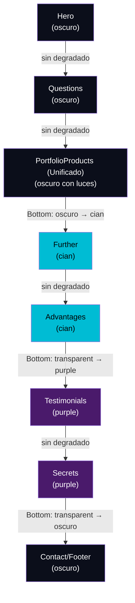

# Flujo de Secciones y Degradados — Landing Page

> Documentación del sistema de transición visual entre secciones de la página principal (`src/routes/index.tsx`).

## Orden de secciones

```
Hero → Questions → PortfolioProducts (Unificado) → Further → Advantages → Testimonials → Secrets → Contact/Footer
```

## Variables de color de fondo

| Variable CSS | Color | Uso |
|---|---|---|
| `--qwik-dark-background` | Azul oscuro/negro | Hero, Questions, PortfolioProducts, Contact |
| `--qwik-light-blue` | Cian claro | Further, Advantages |
| `--qwik-purple-background` | Púrpura oscuro | Testimonials, Secrets |

## Mapa de degradados

Cada degradado usa `h-32` (8rem), `position: absolute`, `pointer-events-none`, y `z-20`.



## Tabla detallada de degradados por componente

| # | Sección | Archivo | Fondo | Degradado | Posición | Clases Tailwind |
|---|---------|---------|-------|-----------|----------|-----------------|
| 1 | Hero | `starter/hero/hero.tsx` | oscuro | — | — | — |
| 2 | Questions | `common-questions/questions.tsx` | oscuro | — | — | — |
| 3 | PortfolioProducts (Unificado) | `portfolio/portfolioProducts.tsx` | oscuro con luces | `oscuro → cian` | **bottom** | `bg-gradient-to-b from-[var(--qwik-dark-background)] to-[var(--qwik-light-blue)]` |
| 4 | Further | `further/further.tsx` | cian | — | — | — |
| 5 | Advantages | `advantages/advantages.tsx` | cian | `transparent → purple` | **bottom** | `bg-gradient-to-b from-transparent to-[var(--qwik-purple-background)]` |
| 6 | Testimonials | `testimonials/testimonials.tsx` | purple | — | — | — |
| 7 | Secrets | `secrets/secrets.tsx` | purple | `transparent → oscuro` | **bottom** | `bg-gradient-to-b from-transparent to-[var(--qwik-dark-background)]` |
| 8 | Contact/Footer | `routes/index.tsx` | oscuro | — | — | — |

## Reglas de diseño

> [!IMPORTANT]
> ### Regla de degradado único
> Cada transición entre dos secciones debe tener **un solo degradado**, ubicado en la sección **de arriba** (posición `bottom`).
> 
> **Nunca** agregar un degradado `top` en la sección de abajo si la sección de arriba ya tiene un degradado `bottom` — esto crea una banda visual duplicada.

> [!TIP]
> ### Espacio para el degradado
> Cada sección que tenga degradado `bottom` debe incluir suficiente padding inferior (`pb-32` o `pb-36`) para que el degradado absoluto (`h-32`) no cubra el contenido.

### Patrón correcto

```tsx
{/* Sección A — tiene el degradado bottom */}
<sectionA class="relative pb-36 ...">
  {/* contenido */}
  <div class="absolute bottom-0 left-0 w-full h-32 bg-gradient-to-b from-[colorA] to-[colorB] pointer-events-none z-20"></div>
</sectionA>

{/* Sección B — SIN degradado top, el de A ya cubre la transición */}
<sectionB class="...">
  {/* contenido */}
</sectionB>
```

### Anti-patrón (degradado duplicado)

```tsx
{/* ❌ INCORRECTO — ambas secciones definen degradado, creando una banda doble */}
<sectionA class="relative ...">
  <div class="absolute bottom-0 ... bg-gradient-to-b from-[colorA] to-[colorB] ..."></div>
</sectionA>

<sectionB class="relative ...">
  <div class="absolute top-0 ... bg-gradient-to-b from-[colorA] to-transparent ..."></div>
</sectionB>
```

## Historial de correcciones

| Fecha | Cambio |
|---|---|
| 2026-09-08 | Eliminado degradado `top` duplicado en `Further` (ya cubierto por `PortfolioProducts` bottom) |
| 2026-09-08 | Eliminado degradado `top` duplicado en `Testimonials` (ya cubierto por `Advantages` bottom) |
| 2026-09-08 | Agregado `pb-36` en `Questions` para evitar que el degradado bottom cubra la última pregunta |
